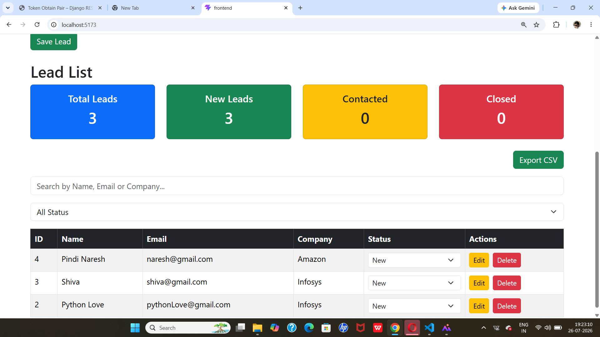
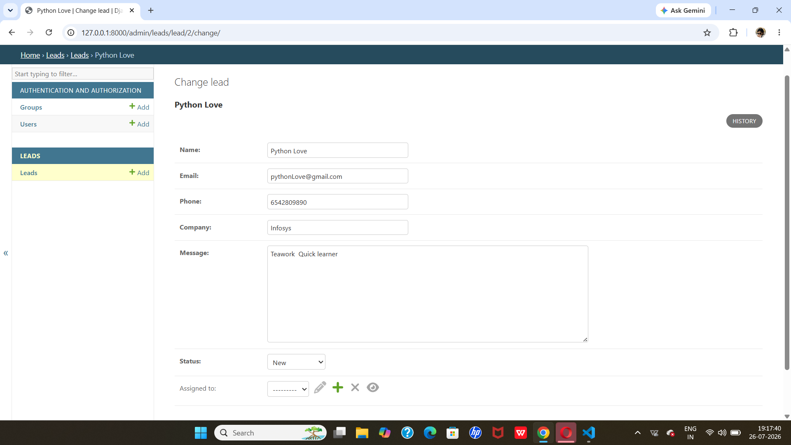
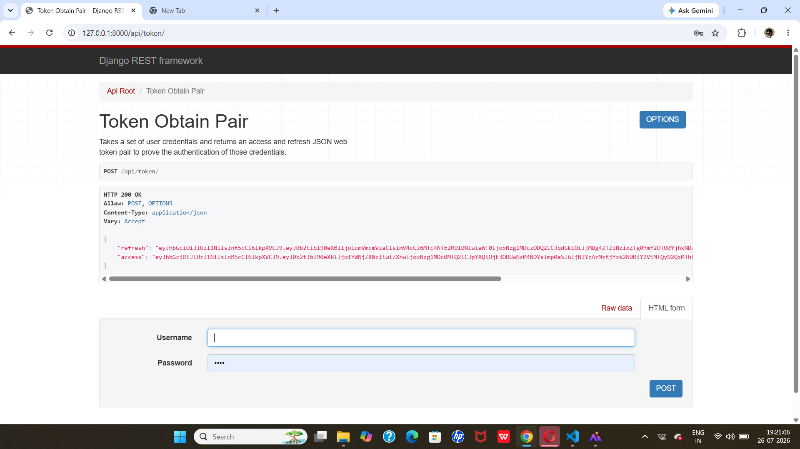
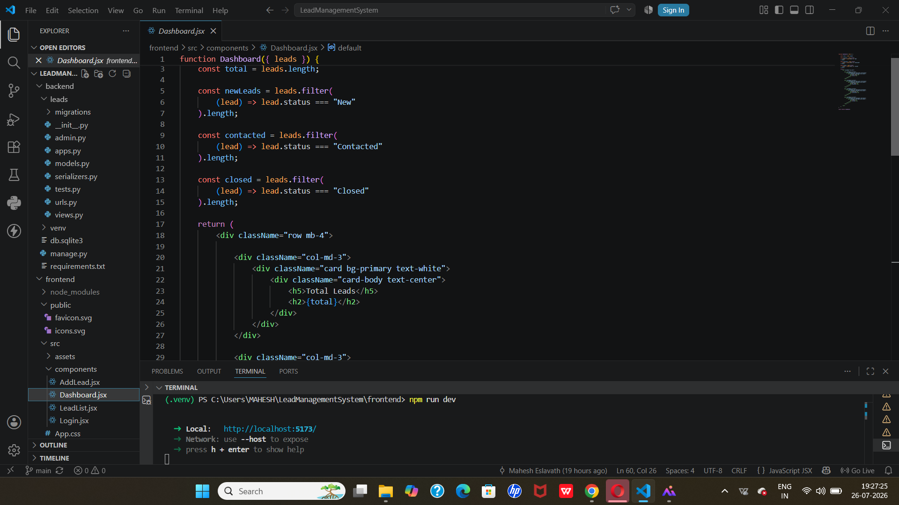

# Lead Management System

A Full Stack Lead Management System developed using **React.js**, **Django REST Framework**, and **JWT Authentication**. The application allows users to securely manage leads with complete CRUD functionality.

---

A Full Stack Lead Management System built using **React.js**, **Django REST Framework**, and **JWT Authentication**. The application allows users to securely manage leads with complete CRUD operations.

## 🚀 Features

- 🔐 JWT Authentication
- ➕ Add Lead
- 📋 View Leads
- ✏️ Edit Lead
- 🗑️ Delete Lead
- 🔍 Search Leads
- 🎯 Filter Leads by Status
- 📊 Dashboard Statistics
- 📁 Export Leads to CSV
- ⚙️ Django Admin Panel
- 🌐 REST API Integration

# 📸 Project Screenshots

## React UI


## Django Admin


## JWT Authentication


## Project Structure

---

# Tech Stack

## Frontend

- React.js
- Bootstrap 5
- Axios
- Vite

## Backend

- Django
- Django REST Framework
- Simple JWT
- django-cors-headers

## Database

- SQLite

---

# Project Structure

```
LeadManagementSystem/
│
├── backend/
│   ├── accounts/
│   ├── leads/
│   ├── backend_project/
│   ├── manage.py
│   └── requirements.txt
│
├── frontend/
│   ├── src/
│   ├── package.json
│   └── vite.config.js
│
└── README.md
```

---

# Installation

## Clone Repository

```bash
git clone https://github.com/YOUR_USERNAME/LeadManagementSystem.git
```

```bash
cd LeadManagementSystem
```

---

## Backend Setup

```bash
cd backend
```

Create Virtual Environment

```bash
python -m venv venv
```

Activate Environment

### Windows

```bash
venv\Scripts\activate
```

Install Dependencies

```bash
pip install -r requirements.txt
```

Run Migrations

```bash
python manage.py migrate
```

Create Superuser

```bash
python manage.py createsuperuser
```

Start Backend Server

```bash
python manage.py runserver
```

---

## Frontend Setup

Open another terminal.

```bash
cd frontend
```

Install Packages

```bash
npm install
```

Run React Application

```bash
npm run dev
```

Frontend URL

```
http://localhost:5173
```

Backend URL

```
http://127.0.0.1:8000
```

---

# API Endpoints

| Method | Endpoint | Description |
|--------|----------|-------------|
| POST | /api/token/ | Login |
| GET | /api/leads/ | Get All Leads |
| POST | /api/leads/ | Create Lead |
| PUT | /api/leads/{id}/ | Update Lead |
| DELETE | /api/leads/{id}/ | Delete Lead |

---

# Project Screenshots

Add screenshots of:

- Login Page
- Dashboard
- Add Lead Form
- Lead List
- Search Feature
- Status Filter
- Export CSV

---

# Future Improvements

- Pagination
- Assign Leads to Users
- Charts and Analytics
- Email Notifications
- Deployment using Render and Vercel

---

# Author

**Mahesh**

Python Full Stack Developer

GitHub: https://github.com/maheshvislavath18-star


---

# License

This project is created for educational and internship assignment purposes.
